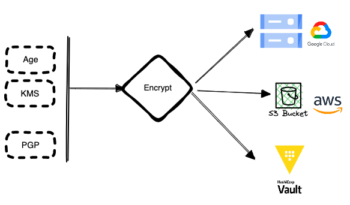

# Dolores

Simplifying secrets management on your cloud.



Encrypts configurations with different encryption algorithm and uses GCP or AWS or Vault as storage.

## Setup

Configure for different environments to manage secrets

```bash
dolores --env production init
```

Enter the GCS bucket name where you want to store the application configuration

## Encrypt a plain env file

To encrypt a plain env file `backend.env` for production environments and upload it to GCS bucket, run the following

```bash
dolores --env production config encrypt -f backend.env --name backend-01
```
Once the file is encrypted successfully, you can remove the local plaintext file.


## Edit config
You can edit the remote config file with the following command

```bash
dolores --environment production config edit --name backend-01 -key-file $HOME/.config/dolores/production.key
```

### Decrypt config

Prefer to use edit and run over decrypt as required, In case of you need to have env var file locally, decrypt the config with the following command

```bash
dolores --environment production config decrypt --name backend-01 -key-file $HOME/.config/dolores/production.key
```

## Run commands with config

You can run a bash command or script and pre-load required config, so it's limited to the command's process.

```
dolores --env production run --with-config backend-01 -key-file $HOME/.config/dolores/production.key
```
